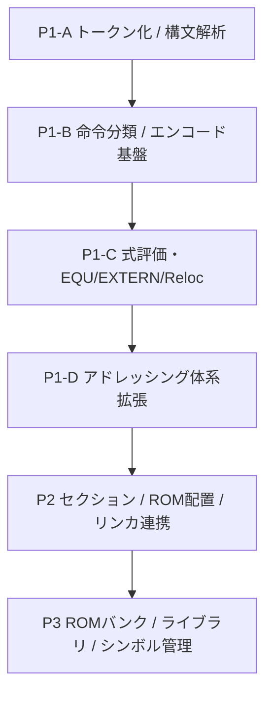

# 🧩 P1-D アドレッシング体系拡張仕様書

> Version: Draft-1
> Date: 2025-10-07
> Author: MST
> Phase: **P1-D (Addressing Extension Phase)**

---

## 🎯 目的（Goal）

P1-Cで確立した式評価・外部参照（Reloc）基盤をもとに、
**Z80のアドレッシング体系（インデックス・相対・間接アドレス）を完全定義・実装**する。

これにより：

* 命令構文解析およびエンコード層の拡張
* 8bit/16bit/PC相対即値式の範囲検証
* IX/IYプレフィクスと符号付き変位（displacement）評価の統一
* `$`（現在アドレス）による式評価の統合

を実現し、P2以降のセクション／ROM配置処理に耐え得る中間表現を完成させる。

---

## 🧱 フェーズ前提（Dependencies）

| 依存フェーズ  | 機能概要                                                     |
| ------- | -------------------------------------------------------- |
| ✅ P1-B  | オペランド分類 (`classifyOperand`) 基本構造確立                       |
| ✅ P1-C  | `evalExpr` / `resolveExpr8/16` / `Reloc` / `EXTERN` 実装完了 |
| ⚠️ 拡張範囲 | `$`シンボル対応、`JR`/`IX+d`の式評価と範囲チェックを本フェーズで追加                |

---

## 📘 スコープ（Scope）

| No | 機能区分            | 概要                                              | 評価対象                                            |
| -- | --------------- | ----------------------------------------------- | ----------------------------------------------- |
| 1  | **PC相対ジャンプ命令**  | `JR`, `DJNZ`, `JR C,xx`, `JR NZ,xx`, etc.       | `$`を含む式のPC相対化（`target - ($+2)`）±128範囲検証         |
| 2  | **インデックス付き命令群** | `(IX+d)` / `(IY+d)` 系の LD / INC / DEC / ADD     | displacement式評価（`resolveExpr8`）＋prefix制御（DD/FD） |
| 3  | **絶対間接アドレス**    | `LD A,(nn)` / `LD (nn),A` / `LD HL,(nn)`        | `(expr)`→`resolveExpr16()`評価・Reloc可否ルール         |
| 4  | **I/Oポート即値**    | `IN A,(n)` / `OUT (n),A`                        | 8bit式評価（符号なし）、0〜255範囲検証                         |
| 5  | **`$`特殊シンボル**   | 式中の`$`を`ctx.loc`へ置換                             | 現在アセンブル位置を返す予約記号として導入                           |
| 6  | **即値式汎用拡張**     | `ADD A,EXT+1` / `LD B,FOO-BAR`                  | Reloc継承確認（size=1除外）＋符号付/無差異統一                   |
| 7  | **オペランド拡張体系**   | `OperandKind`拡張 (`IDX`, `IND16`, `REL`, `PORT`) | Z80構文体系を正規化・分類                                  |
| 8  | **範囲検証とエラー**    | ±128, 0–255, 16bit越え                            | `OutOfRange8` / `OutOfRangeRel` 追加              |

---

## 🚫 スコープ外（Out of Scope）

| 項目                         | 理由                        |
| -------------------------- | ------------------------- |
| `.text/.data/.bss` セクション分割 | P2でセクションIDを伴うReloc設計を導入予定 |
| ROMバンク切替                   | P3以降（FAR CALL実装段階）        |
| ブロック転送命令（LDIR等）            | evalExpr不要、後続フェーズで包括対応    |
| 命令網羅実装                     | P1-Eまたは命令網羅フェーズで実施        |

---

## ⚙️ 実装項目（Implementation Tasks）

| ID  | 対象コンポーネント                     | 追加・修正内容                                 |
| --- | ----------------------------- | --------------------------------------- |
| D-1 | `evalExpr()`                  | `$`（現在アドレス）を評価可能にする                     |
| D-2 | `resolveExpr8()`              | displacement評価・±128範囲検証追加               |
| D-3 | `classifyOperand()`           | `(IX+expr)` / `(IY+expr)` を `IDX` として分類 |
| D-4 | `encodeLD()` / `encodeALU()`  | DD/FD prefix付与・displacementバイト出力        |
| D-5 | `encodeJR()` / `encodeDJNZ()` | 相対距離算出＋範囲検証処理を導入                        |
| D-6 | `AssemblerErrorCode`          | `OutOfRange8`, `OutOfRangeRel` 新設       |
| D-7 | `operand/types.ts`            | `IDX`, `REL`, `IND16`, `PORT` の型を追加     |
| D-8 | `rel/test/fixture-p1d.asm`    | JR, IX/IY, (nn), IN/OUT, `$`を含むフィクスチャ作成 |

---

## 🧪 完了条件（Definition of Done）

| 観点          | 判定条件                                                       |
| ----------- | ---------------------------------------------------------- |
| ✅ テスト網羅     | `__tests__/integration/p1d_fixture.test.ts` が全命令網羅＆正常アセンブル |
| ✅ エラーハンドリング | 範囲外・未定義・Reloc禁止条件時に正しい例外を発生                                |
| ✅ Reloc正当性  | 16bit即値はReloc許可、8bit (JR/IX+d) は禁止                         |
| ✅ 実行バイナリ一致  | openMSX等で実機互換動作が確認できる                                      |
| ✅ ドキュメント    | 本ファイルおよび命令分類表が最新状態に更新済                                     |

---

## 🧩 オペランド分類体系（OperandKind）

| Kind    | 例                   | 内容        | Reloc可否 |
| ------- | ------------------- | --------- | ------- |
| `IMM8`  | `LD A,1`            | 即値8bit    | 可（内部即値） |
| `IMM16` | `LD HL,1000H`       | 即値16bit   | 可       |
| `IDX`   | `(IX+5)` / `(IY-3)` | インデックス＋変位 | ❌（内部式）  |
| `REL`   | `JR NZ,LABEL`       | PC相対      | ❌       |
| `IND16` | `(TABLE)`           | 絶対間接      | 可       |
| `PORT`  | `(0x20)`            | I/Oポート即値  | ❌       |

---

## 📗 エラー仕様（AssemblerErrorCode 追加）

| コード                   | 意味              | 発生条件                   |
| --------------------- | --------------- | ---------------------- |
| `OutOfRange8`         | 8bit即値範囲外       | 0–255超過                |
| `OutOfRangeRel`       | 相対距離範囲外         | ±128超過                 |
| `InvalidDisplacement` | `(IX+expr)` 式異常 | displacement未解決または型不整合 |

---

## 📘 想定アセンブル例（Fixture抜粋）

```asm
; P1-D Fixture Sample
    ORG 0x100

START:
    JR NEXT
    DJNZ START
NEXT:
    LD A,(IX+5)
    LD (IY-3),B
    ADD A,(IX+1)
    LD HL,(TABLE)
    LD (TABLE),A
    IN A,(0x20)
    OUT (0x30),A
    LD DE,$+10
TABLE: DB 0,0
    END START
```

---

## 🧩 フェーズ構造図



---

## ✅ 成果物一覧

| 種別     | ファイル・ディレクトリ                                     | 概要              |
| ------ | ----------------------------------------------- | --------------- |
| 実装     | `src/assembler/encoder/ixy.ts`                  | IX/IY命令エンコーダ    |
| 実装     | `src/assembler/encoder/jr.ts`                   | JR/DJNZ命令エンコーダ  |
| 実装     | `src/assembler/operand/types.ts`                | OperandKind拡張定義 |
| テスト    | `src/__tests__/integration/p1d_fixture.test.ts` | 統合アセンブルテスト      |
| ドキュメント | `docs/assembler/P1-D.md`                        | 本仕様書            |
| フィクスチャ | `rel/test/fixture-p1d.asm`                      | 機能網羅アセンブリ       |

---

## 🧭 次フェーズ（P2）への引き継ぎ項目

| 項目               | 内容                   |
| ---------------- | -------------------- |
| Reloc拡張          | セクションID付与・リンク後再配置可能化 |
| SymbolTable      | セクション別・外部シンボル参照分離    |
| ORG/SECTION命令    | セクション切替制御の導入         |
| AssemblerContext | 現在セクション情報を持つ構造体へ拡張   |

